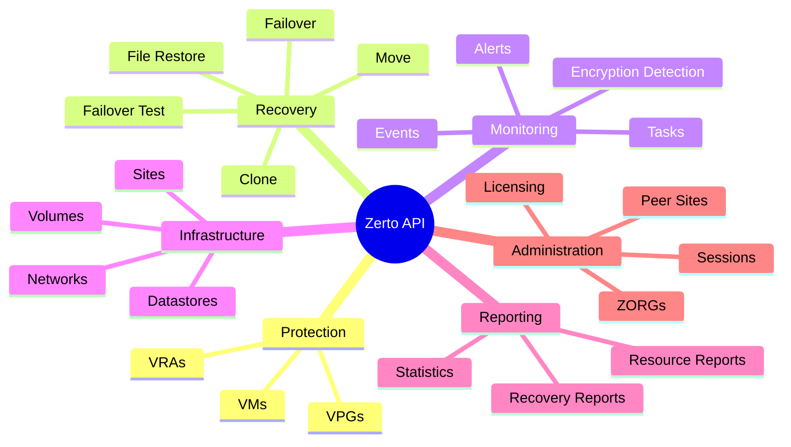

# ZertoSwaggerAPI
# Zerto REST API Automation Toolkit

**Version**: 10.0 Update 6 | **Auth**: Keycloak OAuth2 | **Port**: 443

---

## Why Automate Zerto?

Every DR test you run manually is time you could spend on something else. The Zerto REST API turns hours of clicking into seconds of code — and it scales to every VPG in your environment simultaneously.

What you can do with a few lines of PowerShell:

- Pull a full inventory of every protected VM across all VPGs — instantly
- Kick off failover tests at 2am via scheduled task, get results in your inbox by morning
- Detect ransomware encryption events programmatically and respond before anyone notices
- Build a self-service DR portal for app teams without giving them ZVM access
- Generate compliance reports proving your RPO/RTO targets are met

---

## 30-Second Quick Start

```powershell
# 1. Authenticate (one-time per session)
$Cred = Get-Credential -Message 'Zerto API'
$Token = (Invoke-RestMethod -Uri 'https://zvm.example.com:443/auth/realms/zerto/protocol/openid-connect/token' `
    -Method POST -Body @{
        grant_type = 'password'
        client_id  = 'zerto-client'
        username   = $Cred.UserName
        password   = $Cred.GetNetworkCredential().Password
    } -SkipCertificateCheck).access_token

$H = @{ Accept = 'application/json'; Authorization = "Bearer $Token" }

# 2. Get all VPGs — see your entire DR posture in one call
Invoke-RestMethod -Uri 'https://zvm.example.com:443/v1/vpgs' -Headers $H -SkipCertificateCheck

# 3. Get all protected VMs
Invoke-RestMethod -Uri 'https://zvm.example.com:443/v1/vms' -Headers $H -SkipCertificateCheck
```

That's it. You're in. Everything else is just choosing which endpoint to hit.

---

## What Can You Automate?

| Use Case | Endpoint | Impact |
|----------|----------|--------|
| Full VPG + VM inventory | `GET /v1/vms` | Replace 30 min of UI clicking with 2 seconds |
| Scheduled failover tests | `POST /v1/vpgs/{id}/FailoverTest` | Prove DR readiness without manual effort |
| Ransomware detection | `GET /v1/encryptionDetection/suspected/vms` | Catch encryption before it spreads |
| VRA health monitoring | `GET /v1/vras` | Alert on degraded replication before it's too late |
| Recovery reports | `GET /v1/reports/recovery` | Audit-ready reports for compliance |
| Automated failover | `POST /v1/vpgs/{id}/Failover` | Sub-minute RTO for critical apps |
| File-level restore | `POST /v1/flrs` | Mount and recover individual files without full VM restore |
| Long-term retention | `GET /v1/ltr/catalog/vms` | Manage retention sets programmatically |

---

## Available Scripts (Ready to Use)

| Script | What It Does |
|--------|--------------|
| `Get-ZertoAllVpgVMs.ps1` | Exports all VMs across all VPGs to CSV — supports multiple ZVMs |
| `Get-ZertoVpgVMs.ps1` | Query VMs in a specific VPG by name |

Both scripts handle Keycloak auth, self-signed certs, and CSV export automatically.

---

## API Categories at a Glance



---

## Real-World Recipes

### Daily DR Compliance Report

```powershell
# Get all VPGs, check RPO status, email any violations
$VPGs = Invoke-RestMethod -Uri "$Base/vpgs" -Headers $H -SkipCertificateCheck
$Violations = $VPGs | Where-Object { $_.ActualRPO -gt $_.ConfiguredRpoSeconds }
if ($Violations) {
    $Violations | Select-Object VpgName, ActualRPO, Status |
        Export-Csv ".\reports\RPO-Violations_$(Get-Date -f yyyy-MM-dd).csv" -NoTypeInformation
}
```

### Automated Failover Test (Scheduled Task)

```powershell
# Run FO test for a VPG, wait, then stop it
$VpgId = ($VPGs | Where-Object VpgName -eq 'SQL-Prod').VpgIdentifier
$Body = @{ CheckpointIdentifier = $null } | ConvertTo-Json
Invoke-RestMethod -Uri "$Base/vpgs/$VpgId/FailoverTest" -Method POST -Headers $H -Body $Body -ContentType 'application/json' -SkipCertificateCheck
Start-Sleep -Seconds 300
Invoke-RestMethod -Uri "$Base/vpgs/$VpgId/FailoverTestStop" -Method POST -Headers $H -SkipCertificateCheck
```

### Ransomware Early Warning

```powershell
$Suspected = Invoke-RestMethod -Uri "$Base/encryptionDetection/suspected/vms" -Headers $H -SkipCertificateCheck
if ($Suspected) {
    Write-Warning "ENCRYPTION DETECTED on $($Suspected.Count) VM(s)!"
    # Trigger incident response...
}
```

---

## Reference Documentation

Full endpoint reference with parameters, methods, and response types:

**[Zerto API 10.0 U6 Reference](./Zerto-API-10.0-U6-Reference.md)**

---

## Tips

- Token expires after ~5 minutes — refresh before long-running loops
- All identifiers are GUIDs — use `GET /v1/vpgs` to map names to IDs
- URL-encode VPG names with spaces: `[System.Uri]::EscapeDataString('My VPG')`
- Use `-SkipCertificateCheck` (PowerShell 7) for self-signed ZVM certs
- Add `-TimeoutSec 120` for large environments with many VMs
- Events and Alerts support date filtering — use `v1/serverDateTime` to get the expected format
